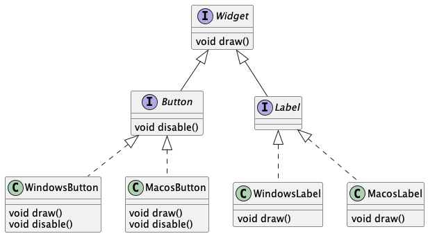
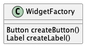
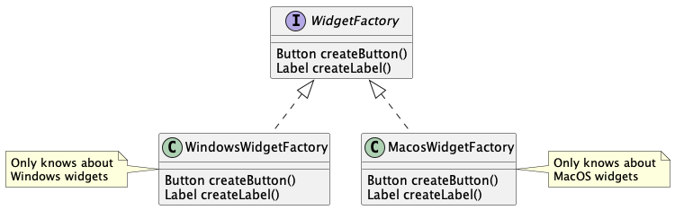

# Design Patterns

## WTF are Design Patterns?

There are multiple ways to describe what design patterns are. For me,
the most useful definition is as follows:

A design pattern
- has a **_name_**
  - for example: _Factory Method_
- has an **_intent_**
  - provide objects
- aims to **_reduce dependencies_**
  - the user of the factory method does not need to know about any concrete object types
- provides some sort of **_abstraction_**
  - the user only needs to know the interface, how objects are actually instantiatet is of no concern to her
- has been **_proven to work_** over the years
  - if you do something fancy that matches all requirements above, it doesn't mean it's a design pattern. Is has to withstand the test of time first.

## Gimme some Patterns, please!

### Factories

#### Static Factory Method

A static method that provide objects. This is mostly used as a more flexible alternative to
constructors, but can also be used for more involved use cases.

Advantages over constructors:
- Does not need to create a new object (unlike `new`), so it can be used to implement the Singleton
  design pattern (see below).
- Can have a descriptive name (e.g. valueOf(), randomShape(), ...)

Examples you know already:
- `Integer.valueOf(someString)`
- `List.of(1, 2, 3, 4)`

#### Factory Method

This is one level of abstraction up from the _Static Factory Method_. It's now an instance method that provides
objects, which means we can now take advantage of polymorphism. It's typically used to return objects that are related
to concrete types, without the user having to know about it.

Example: picture you have an office suite like LibreOffice which consists of multiple `Application`s (the interface)
like `WriterApplication` or `SpreadsheetApplication` (concrete classes). Now let's assume we want to create a new
document for whatever application is currently active, and our code so far looks like this:

```java
Application activeApplication = getActiveApplication();
```

How could we possible know what kind of document we need to create? A text document? A spreadsheet? A presentation?
```java
Document newDocument = null;
if (activeApplication instanceof WriterApplication)
	newDocument = new TextDocument();
else if (activeApplication instanceof SpreadsheetApplication)
	newDocument = new SpreadsheetDocument();
else ...
```

As you can probably see by now, this can get out of hand very quickly. It's also extremely error prone. What if you need
to create new documents at multiple places in your application? If another application is added, you have to remember
to update every occurrence in your code. Remember: copy and pasting code is the root of all evil :-).

Now you might think: why not simply put this neat peace of if-else in a _Static
Factory Method_ and use that whenever you need a new document? I like the way you think, but still: the person adding a
new application may not be aware of this piece of code, so you are still likely to find a bug on the customer side.

This is exactly where the _Factory Method_ starts to shine: since we can utilize the polymorphic behavior in our class
hierarchies, this is a natural match: just let each application provide a new document itself. Now let's pull everything
together:

```java
public interface Application {
  Document newDocument();
}

public class WriterApplication implements Application {
  TextDocument newDocument() {
	  return new TextDocument();
  }
}

public class SpreadsheetApplication implements Application {
  SpreadsheetDocument newDocument() {
	  return new SpreadsheetDocument();
  }
}

Application activeApplication = getActiveApplication();

Document newDocument = activeApplication.newDocument();
```

Just if you are wondering: Yes, you can return a **more specific** type in subclasses.

Examples you already know:
- `Socket.getInputStream()` (e.g. a `SSLSocket` will return a different type of `InputStream` than your normal
  off-the-shelf kind of `Socket`).

#### Abstract Factory

This is upping the ante yet again - let's add another layer of abstraction! Not only is the _Abstract Factory_
polymorphic like the _Factory Method_, but it introduces a whole hierarchy of factories! But before you give in to your
headache and resign in despair, let's set the new stage:

Our fictional desktop has to support multiple operating systems. Unfortunately, there is no common ground when it comes
to drawing UI elements (widgets) on the screen: Windows handles this completely different than MacOS. So we are
basically ending up with something like this to represent our UI elements:



To draw a button on Windows, we have to use a `WindowsButton`, on a Mac we need a `MacosButton`. This means, everytime
we want to create some widget, we will need to see whether we are running on Windows or MacOS and create the appropriate
flavour of our widget:

```java
class DesktopApp {
  public void showDialog() {
    Button okButton = null;
    if ("Windows".equals(System.getProperty("os.name")))
      okButton = new WindowsButton();
    else if ("Mac OS X".equals(System.getProperty("os.name")))
      okButton = new MacosButton();
    else ...
  }
}
```

Describing this as an annoying coding practice would probably count as euphemism. So what can we do about it?

No, seriously, I'm asking **you**. Think about it before you read ahead.

In the previous chapter we put the responsibility to create new documents on the concrete office applications. In this
case it's not going to be so easy. After all, we just have our desktop application. It is the same on all operating
systems. There is no `WindowsApp` or `MacosApp`, just a `DesktopApp`. So we need something else. Let's call it
`WidgetFactory`. A first naive approach could look like this:



Now we can simply confine the annoying code to a single class. Everytime we create a new widget, the `WidgetFactory`
figures out which OS we are running on and returns the appropriate flavour back to us. However, unfortunately we are not
done yet; first of all this violates the single responsibility principle - the `WidgetFactory` should not concern itself
with low level implementation details like figuring out what OS we are running on. It should just create widgets. In
addition the code to create Windows widgets may not even compile on MacOS - and vice versa. So - what can we do about
it?

In an ideal world, we would just decide once at the start of our application what kind of widgets we are going to need
and be done with it. And - believe it or not - we truly are living in this ideal world! And all it takes is to make our
simple factory from above abstract and provide a concrete factory for each platform we are going to support:



Looking at this diagram you may wonder if `createButton()` and `createLabel()` are actually _Factory Methods_. Yes,
they indeed are. The _Abstract Factory_ pattern is utilizing the _Factory Method_ pattern.

Now we only need to check the operating system once when we are starting our application. From there on, our desktop
application can rely on the blissed ignorance of the `WidgetFactory` interface to create appropriate widgets whenever
it needs them:

```java
class DesktopApp {
  WidgetFactory widgetFactory;
  
  public DesktopApp() {
    if ("Windows".equals(System.getProperty("os.name")))
      widgetFactory = new WindowsWidgetFactory();
    else if ("Mac OS X".equals(System.getProperty("os.name")))
      widgetFactory = new MacosWidgetFactory();
    else ...
  }

  public void showDialog() {
    Label disclaimer = widgetFactory.createLabel();
    Button okButton = widgetFactory.createButton();
    Button cancelButton = widgetFactory.createButton();
  }
}
```

##### Bonus

In Java, when overriding a method, the return type can be **_covariant_**. This means you can return a more specific
data type in derived classes. In the example above, `createButton()` returns a `Button` object in the base class and we
are mimicking this behavior in the derived classes. However, since we are allowed to return a more specific type, we
could also return a `WindowsButton` in case of the `WindowsWidgetFactory` or a `MacosButton` in case of the
`MacosWidgetFactory`:

![Abstract Factory with ]

Covariant return types are based on the _Liskov Substitution Principle_.

### Singleton

While this is one of the classic patterns covered in the original Design Patterns book from the gang of four, I do not
consider it as a design pattern personally. While it clearly has a name and an intent and has proven itself over time,
it does not reduce dependencies nor does it provide any form of abstraction. If anything, it tends to _increase_
coupling between components and generally leads to code that is harder to test.

To see why that is, lets first look at what it aims to do: the _Singleton_ design pattern is enforcing a policy that to
allow only a single object of a class to exist. One example of this would be a logger - no matter where you are in the
code, it should always log to the same resource (e.g. some file or stdout) and hence use the same logger object.

Since using the `new` keyword always creates another object in Java, the _Singleton_ pattern always implies to hide the
constructor (i.e. make it private). Beyond this, you have a lot of options to implement this pattern:

#### Public Static Field

```java
public class Logger {
  public static final Logger INSTANCE = new Logger();

  private Logger() {
  }

  public void log(String message) {
    System.out.println(message);
  }
}

public class App {
  public static void main(String[] args) {
    Logger logger = Logger.INSTANCE;
    logger.log("Hello World");
  }
}
```

This guarantees that exactly one instance of class `Logger` will exist at any given moment in time, that can be
accessed via the classes `INSTANCE` field. Note that you have to make the field `final`.

#### getInstance() Method

```java
public class Logger {
	private static final Logger INSTANCE = null;
	
	public static Logger getInstance() {
		if (INSTANCE == null)
			INSTANCE = new Logger();
		return INSTANCE;
    }
	
	private Logger() {
    }
	
	public void log(String message) {
		System.out.println(message);
    }
}

public class App {
  public static void main(String[] args) {
    Logger logger = Logger.getInstance();
    logger.log("Hello World");
  }
}
```

This should only be used if it is necessary to postpone the creation of the sole instance until you need it (this is
called **_lazy initialization_**). Despite its innocent appearance, this way of implementing a _Singleton_ opens a can
of worms (or should I say problems...). In our hello world example, everything is dandy. However, as soon as you
introduce multithreading to the equation, the safe implementation of the `getInstance()` method becomes... challenging
(and thereby error prone).

Don't use this, unless you have to.

Btw, did you recognize an old friend in the `getInstance()` method? Yes, that's right - it's a _Static Factory Method_ :-)

#### Enum

```java
public enum Logger {
  INSTANCE;
  
  public void log(String message) {
    System.out.println(message);
  }
}

public class App {
  public static void main(String[] args) {
    Logger logger = Logger.INSTANCE;
    logger.log("Hello World");
  }
}
```

This is by far the most preferable variation of the bunch. Because enums are _Singleton_s by nature, it makes for a
natural fit. While there are a couple of limitations on enums that are not on normal classes, you are likely not
bothered by them. If you are, you will immediately know and can fall back on the public static field method. From the
perspective of the user the two are identical.

Bottom line: Use the **Enum** variant if possible and the **Public Static Field** method otherwise. Only use the
**getInstance() Method** if everything else fails to work for your use case.
