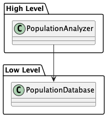
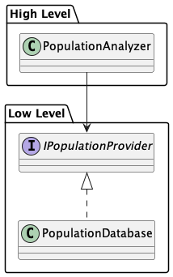
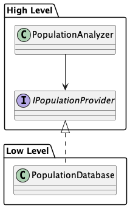

# The SOLID Principles

- **S**ingle responsibility
- **O**pen / Closed
- **L**iskov substitution
- **I**nterface segregation
- **D**ependency inversion

The SOLID principles are meant as general guidelines to keep code more maintainable, that is, easy to change. In essence,
they are all about change.

## Single Responsibility Principle (SRP)

A popular translation of this principle is:

> Your _class/method/module_ should do just **one** thing, but do it **very well**.

While this may somehow sets the right tone, the SRP is really more about separation of concerns. Your particular piece
of code should have as few concerns as possible. Ideally it has only one concern and therefore only one reason to change.


## Open / Closed Principle (OCP)

Code should be **open** for extension, but closed for **modification**. In essence this means that if you always have
to make changes to your existing code in order to introduce new functionality, this becomes brittle and tiresome really
fast:

```java
public enum Animal {
	DOG, CAT, COW;
}

public class App {
	public void makeAnimalLoud(Animal animal) {
		switch (animal) {
			case DOG -> System.out.println("Wuff");
			case CAT -> System.out.println("Wuff");
			case COW -> System.out.println("Wuff");
			default -> throw new IllegalArgumentException("No such animal: " + animal);
		}
	}
}
```

Everytime you introduce a new animal to your application, you have to change your existing implementation of
`makeAnimalLoud`.

You should therefore be able to introduce new functionality be just writing new code:

```java
public interface Animal {
	void speak();
}

public class Dog implements Animal {
	@Override
	public void makeLoud() {
		System.out.println("Wuff");
	}
}

public class Cat implements Animal {
	@Override
	public void makeLoud() {
		System.out.println("Meow");
	}
}

public class Cow implements Animal {
	@Override
	public void makeLoud() {
		System.out.println("Muh");
	}
}

public class App {
	public void makeAnimalLoud(Animal animal) {
		animal.speak();
	}
}
```

Now you could easily just introduce a new kind of animal - for example a donkey - and there would be no need to change
any piece of existing code and thereby accidentally screwing up existing stuff. It would _just work™_.


## Liskov Substitution Principle (LSP)

This principle is named after Barbara Liskov. It states that you must be able to replace an object by a subtype without
breaking the program. This basically means that the subtypes should exhibit the same semantic behavior. Put another way:
`Donkey.makeLoud()` should not format your hard drive, it should emmit a donkeys noise (whatever that means in the
context of your application).


## Interface Segregation Principle (ISP)

You should not make monsterous interfaces that are covering multiple use cases, but instead keep them focused on only
a single concern. This can be seen as a specific instance of the single responsibility principle.

### Bad Example:

```java
interface Animal {
	void die();
	void fly();         // Not all animals can fly
}

class Dog implements Animal {
	void die() { System.out.println("I'm a goner now."); }
    void fly() { throw new UnsupportedOperationException("Dude, dogs can't fly - what's wrong with you?"); }
}

class Raven implements Animal {
	void die() { System.out.println("Crashing and burning."); }
    void fly() { System.out.println("Taking off in 3, 2, 1, ..."); }
}
```

The ISP is also closely related to the Liskov substitution principle: there is no way for a dog to comply with the
semantics of the `Animal` interface. Dogs just can't fly, so we should not try making them. If we keep our interfaces
concise, there is less chance of violating the LSP, as we see in the next example:

### Good Example

```java
interface Animal {
	void die();
}

interface Flyable {
	void fly();
}

class Dog implements Animal {
	void die() { System.out.println("I'm a goner now."); }
}

class Raven implements Animal, Flyable {
	void die() { System.out.println("Crashing and burning."); }
	void fly() { System.out.println("Taking off in 3, 2, 1, ..."); }
}
```

Now the `Animal` interface is as concise as possible. It only describes what all animals are able to do - from corals to
birds alike. Of course, birds can also fly (as can insects), so we are creating an interface for this additional ability
that isn't common to all kinds of animals. In our case we called it `Flyable`. Finally, the dog isn't forced to pretend
you could make it fly, while the raven is still able to.


## Dependency Inversion Principle (DIP)

The dependency inversion principle deals with boundaries of your system. High level components should never depend on
low level components. In essence, your business logic should not depend on implementation details.

As an example, consider we have an application, that should perform some statistical analysis on a population of people:



In this first example, the `PopulationAnalyzer` accesses the `PopulationDatabase` to receive the population for
its number-crunching. On first sight, this seems like a reasonable solution. But now imagine that someone decides to
change the database vendor and the implementation of the `PopulationDatabase` changes with it. Suddenly we are forced
to update our high level component to accommodate the change.

Wait, you might say, I have a suggestion: why not just use an interface to abstract the actual DB vendors implementation
away?



This looks _a lot_ better, right? We are now insulated from the implementation details of a specific vendor. However,
there are still two issues with this solution:

1. We still don't have any control over the interface. The low level package might decide at any point in time to change
   the interface.
2. Imagine we would like to provide some population data as part of a test. Right now we would require the test to
   depend on the low level component. It would also be impossible to switch the low level component against some other
   implementation, as our interface would vanish with the component.

Luckily, there is a very simple fix to that problem: we are pulling the interface into the high level component:



What seems like a minor change, is in fact, the foundation of the DIP: high level components specify the interfaces
they rely upon. These interfaces are then implemented by the low level components. This way we make the parts of our
application that are less likely to change more resilient against changes in the low level components, which are
usually changed a lot more frequently.

This concludes the quick introduction to the SOLID principles.
